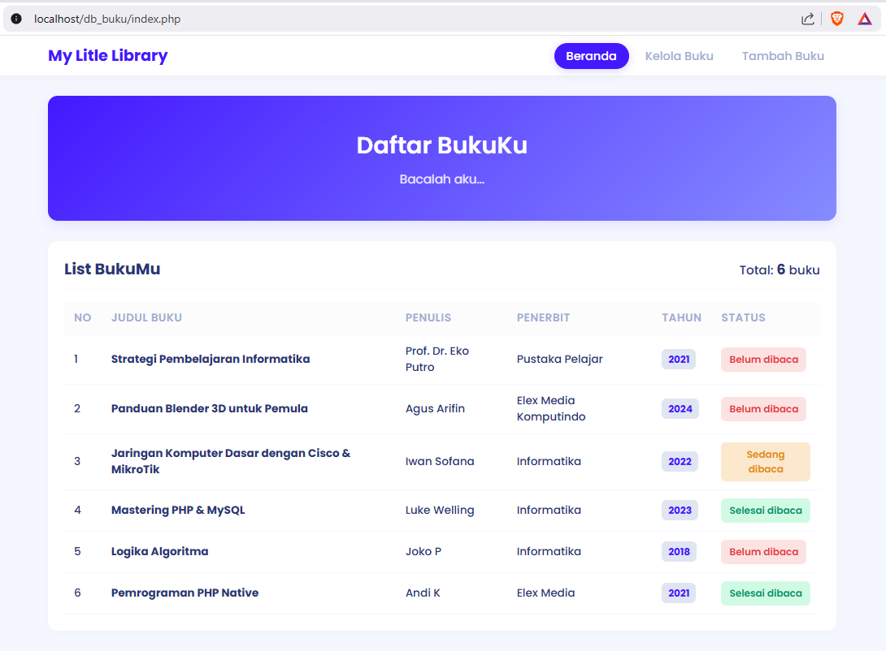
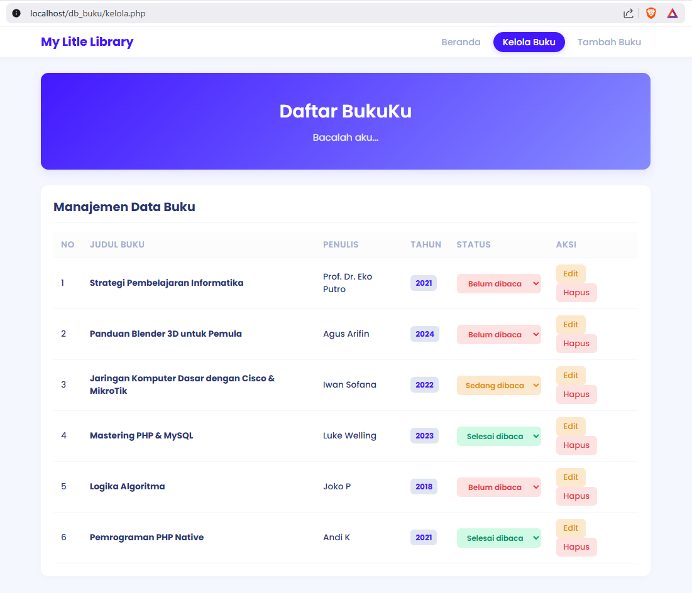

# Sistem Pendataan Buku - My Litle Library

Repositori ini berisi aplikasi web sederhana untuk mengelola koleksi buku pribadi, memantau status baca, dan mengorganisir data buku secara digital. Proyek ini dibuat sebagai pemenuhan tugas UAS Pemrograman Web.

## Identitas Mahasiswa
* **Nama**: Agus Itmam Mudin
* **NIM**: 240631100029

## Deskripsi Aplikasi
**My Litle Library** adalah platform *web-based* yang dirancang untuk membantu pengguna mengelola daftar buku. Aplikasi ini dilengkapi dengan fitur CRUD (*Create, Read, Update, Delete*) serta sistem manajemen status baca (*Belum dibaca*, *Sedang dibaca*, *Selesai dibaca*) yang dapat diubah secara *inline* agar memudahkan pengguna melacak progres membaca mereka.

## Screenshot Aplikasi

1. **Menu Beranda**: 
   
2. **Menu Kelola Buku**: 
   

## Struktur Database
Aplikasi ini menggunakan database bernama `db_buku` dengan tabel `buku` yang memiliki struktur sebagai berikut:

| Field | Type | Keterangan |
| :--- | :--- | :--- |
| `id` | INT (Auto Increment) | Primary Key |
| `judul` | VARCHAR(255) | Judul Buku |
| `penulis` | VARCHAR(255) | Penulis Buku |
| `penerbit` | VARCHAR(255) | Penerbit Buku |
| `tahun` | INT | Tahun Terbit |
| `status` | VARCHAR(20) | Belum/Sedang/Selesai dibaca |

## Alur Penggunaan Aplikasi
1. **Akses Beranda**: Pengguna akan langsung melihat daftar seluruh koleksi buku yang telah ditambahkan beserta total jumlah buku.
2. **Tambah Buku**: Klik menu "Tambah Buku" di navbar, akan muncul *pop-up* form untuk memasukkan detail buku (Judul, Penulis, Penerbit, Tahun). Data akan otomatis tersimpan dengan status *default* "Belum dibaca".
3. **Mengelola Status**: Buka menu "Kelola Buku" untuk melihat daftar buku secara lengkap. Anda dapat mengubah status baca secara langsung melalui *dropdown* pada kolom Status yang akan tersimpan otomatis.
4. **Edit & Hapus**: Pada menu "Kelola Buku", klik tombol "Edit" untuk mengubah informasi buku melalui *pop-up* form, atau klik "Hapus" untuk menghapus data buku dari sistem (dengan konfirmasi).
